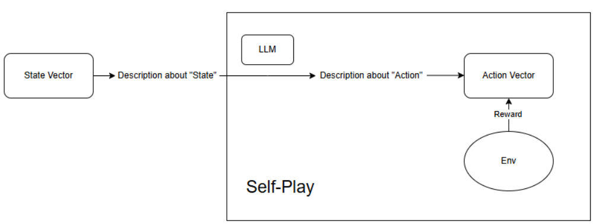

# Negotiation LLM

## DeepSeek-R1-Zero training with self-play (GRPO)
- [DeepSeek-R1 Incentivizing Reasoning Capability in LLMs via Reinforcement Learning - Arxiv-2501.12948](https://arxiv.org/abs/2501.12948)
- Without Search for the first exp
- Expectation: generalization of Math reasoning to negotiation
- Baseline: In Context Learning, Vanilla PPO
## Env: Starting from Exchange Game	
[Emergent Communication through Negotiation - Arxiv-1804.03980](https://arxiv.org/abs/1804.03980)
[Emergent Communication under Competition - Arxiv-2101.10276](https://arxiv.org/abs/2101.10276)

Env: there are 3 kinds of items: a,b,c
- When a env is init, we have random 0-5 a, 0-5 b and 0-5 c. They are uniformly sampled.
- 2 agents in the game
- They will be randomly assigned with a utility to a,b,c. e.g. utility = [[1,4,5], [2,3,6]] means agent 0's utility = 1x(num of a it has) + 4x(num of b it has)+ 5x(num of c it has); agent 1's utility = 2x(num of a it has) + 3x(num of b it has) + 6x(num of c it has).
- The game starts. Agent 0 and agent 1 take turns to propose a vector p = [nb_a, nb_b, nb_c]. If a p is adopted, Agent 0's reward will be dot(p,utility[0]); Agent 1's reward will be dot(pool-p,utility[1]).
- The action space of a agent is: (agree proposal presented by previous agent or not) , (the proposal it gives), (the cheap talk it gives)
- What will be taken into consideration when giving an action is the (proposal presented by previous agent), (the cheap talk presented by previous agent).
- If the agent agrees with the proposal presented by the previous agent. The proposal itself put forward will be ignored and the reward will be immediately calculated.

- [marl-in-pgg](https://github.com/nicoleorzan/marl-in-pgg/blob/main/src/environments/pgg/pgg_parallel_v0.py) 

## Task

### Data (if aimming to deepseek framework in the future)
- Define the template of translation the state, action, vector into the natural language
- Get some CoT data on negotiation
- Find some really world negotiation data for SFT
- https://huggingface.co/datasets/pimpalgaonkar/NegotiationScenarios
- https://huggingface.co/datasets/aladar/craigslist_bargains
- https://huggingface.co/datasets/marcov/craigslist_bargains_promptsource
- https://huggingface.co/datasets/ANASAKHTAR/bargaining_conversational_dataset.csv

### Pesudo training process
- Gather the trajectory offline (self-play)
- Train the model with the trajectory
- Evaluate the model with the trajectory (getting rewards)
- Update the model with the rewards

### Spcecial Senarios
- Fully cooperative
- Fully competitive